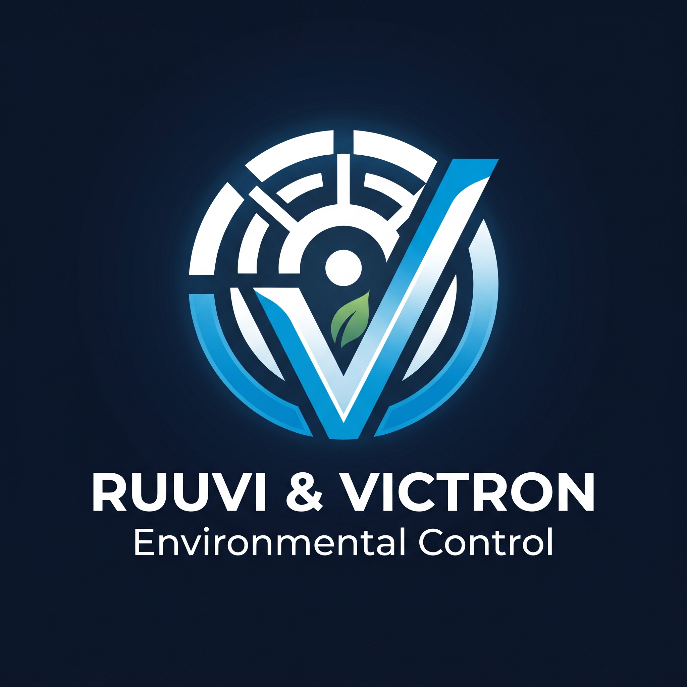

<p align="center">
  
</p>

# ruuvi-victron-environmental-control

Predictive climate control for a Victron ESS equipment room that keeps inverter
internal temperature below the thermal-derating threshold while spending minimum
energy on cooling, using Ruuvi sensors and Cerbo GX / Venus OS.

The controller runs directly on the Cerbo GX. It reads system telemetry over
D-Bus, drives cooling outputs (Cerbo relays, GX IO-Extender, Shelly or Modbus),
and serves a small configuration and status web UI styled to match the Victron
GUI.

## How the control works

The controller runs a loop every 30 seconds. On each tick it reads the sensors
on the bus and the saved configuration, then decides which relays to switch.

### Reference temperature

Every connected temperature sensor is read and the **warmest** reading is used
as the room temperature. Taking the maximum rather than an average is
deliberate: the goal is to keep the hottest spot in the room under control, not
to let a cool corner hide a hot one near the inverter.

### Why 30 °C

Victron rates inverter output at 25 °C and publishes a derating curve: output
stays at 100% up to 30 °C ambient and drops above it (96% at 35 °C, 93% at
40 °C). So 30 °C is the line to stay under to avoid any thermal derating. The
stage start temperatures default from this value; the UI lets you override them.

### Staged cooling

There are two stages, each tied to a relay and each with a start temperature:

- **Stage 1** is the cheaper output (exhaust fans). It has the lower start
  temperature, so it engages first.
- **Stage 2** is the expensive output (AC). It has a higher start temperature
  and only engages when the room climbs past it — that is, when stage 1 alone
  could not hold the temperature.

Staging therefore falls out of the start-temperature ordering: stage 2 is the
backup that runs only when stage 1 is losing. A stage that is disabled in the UI
is always kept off.

Using both stages is not required. You can enable just one relay and leave the
other disabled — how the two outputs are used is your choice. With a single
stage enabled the loop simply runs that one output against its start temperature
and deadband.

### Deadband

Each stage switches on at its start temperature and switches off only after the
temperature has fallen the deadband below it (default 1 °C). This hysteresis
stops a stage cycling rapidly on and off when the temperature sits right at the
setpoint.

### Energy-aware cooling (optional)

By default the stages run purely on temperature. When energy-aware cooling is
enabled, the controller also looks at the live solar and battery figures and
only spends cooling energy when it is cheap. Each tick it computes the solar
surplus — PV power minus the AC and DC loads — and decides which stages are
allowed to run:

- Battery below the configured floor: no cooling from the battery, so cooling
  never drains it past that level.
- Surplus above the stage 1 threshold: stage 1 (the cheap exhaust) may run.
- Surplus above the stage 2 threshold: stage 2 (the expensive AC) may run too.
- No surplus (the cooling would draw from the grid): nothing runs on cost
  grounds.

Temperature still has the final say within what energy permits: a permitted
stage only switches on once the room passes its start temperature. The surplus
thresholds have a small margin so a stage that is already running does not gate
itself off the moment its own draw eats into the surplus.

Two things always override the energy logic, because hardware protection beats
cost:

- If the room reaches the grid-cooling temperature (default 50 °C), the
  controller cools from any source, the grid included, to keep the inverter out
  of heavy derating.
- A gas-evacuation alarm (below) always runs the exhaust, on the grid if need be.

All of this is off by default and configured from the UI; with energy-aware
cooling disabled the controller is a plain thermostat.

### Air-quality override

If a Ruuvi Air is present and the air-quality alarm is enabled, the controller
also watches CO2 and NOX. When either exceeds its configured limit it forces
stage 1 (the exhaust) on to evacuate the gas — independently of temperature, the
energy situation, and even if stage 1 cooling is disabled — and raises an alarm
in the UI. When the readings come back under the limits, stage 1 returns to
normal cooling control.

## Requirements

- A Cerbo GX (or other GX device) running Venus OS.
- Root access enabled on the GX (Settings -> General -> set a root password,
  and enable SSH on LAN).
- [SetupHelper](https://github.com/kwindrem/SetupHelper) installed. It keeps the
  package installed across reboots and reinstalls it automatically after a Venus
  OS firmware update.

## Install on the Cerbo

Enable root access and SSH on the GX, connect, and run the installer. It checks
prerequisites, installs SetupHelper if missing, picks the package for the device
architecture (ARMv7 for Cerbo GX MK1/MK2, ARM64 for aarch64 GX devices),
downloads it and registers the service:

```
ssh root@<cerbo-ip>
wget -qO- https://raw.githubusercontent.com/bolchisb/ruuvi-victron-environmental-control/main/scripts/install.sh | sh
```

By default this installs the latest release. To install a specific release
(including a pre-release), set `TAG` on the shell that runs the script:

```
wget -qO- https://raw.githubusercontent.com/bolchisb/ruuvi-victron-environmental-control/main/scripts/install.sh | TAG=v.0.1.0-dev1 sh
```

When it finishes, open the UI:

```
http://<cerbo-ip>:8088
```

The service runs under daemontools as `/service/ruuvi-control` and is reinstalled
automatically after a firmware update via SetupHelper. The listening port
(`UI_PORT`) and the path of the persisted stage settings (`CONFIG_PATH`, kept
under `/data` so it survives firmware updates) can be changed in
`/data/ruuvi-victron-control/services/ruuvi-control/run`.

If the GX has no internet access, download the matching
`ruuvi-victron-control-<arch>.tgz` from the releases page onto a USB stick,
extract it into `/data`, and run `/data/ruuvi-victron-control/setup`.

### Removing it

Run `/data/ruuvi-victron-control/setup` and choose "Uninstall", or use the
SetupHelper package manager in the GUI.

## Build from source

The binary is cross-compiled inside Docker for both supported GX architectures
(ARMv7 and ARM64). It is never built on the host.

```
scripts/build.sh            # build and package both architectures into ./dist
scripts/build.sh --publish  # also create/upload the GitHub release
scripts/build.sh mac        # build a local binary to test on this machine
```

The version comes from the `VERSION` environment variable, or the `version` file
if it is not set. `--publish` requires the `gh` CLI to be authenticated.

Releases are produced automatically: pushing a tag runs the release workflow,
which builds both architectures and publishes a release named after the tag.

### Testing locally

`scripts/build.sh mac` cross-compiles a binary for this machine in Docker. Run
it with `./dist/mac/ruuvi-control` and open `http://localhost:8088`. There is no
system bus off-device, so the UI reports the bus as unavailable and metrics show
as not available, but the UI, configuration and HTTP API can be exercised.

Before building, drop `Roboto-Regular.ttf` into
`internal/web/static/` so the UI serves the Victron font offline (see the note
in that directory).

## Changelog

### v0.1.0

- Initial controller skeleton that connects to the Venus OS system bus over
  D-Bus and reads live battery state of charge, voltage and power, PV power and
  DC system loads. AC loads and the grid connection are read straight from the
  inverter (VE.Bus, discovered from the system service) using the phase totals,
  so the figures are correct on both single-phase and three-phase systems.
- Temperature sensor discovery: enumerates the temperature services on the bus
  and reads temperature, humidity and pressure for each, plus CO2, VOC, NOX and
  PM2.5 from Ruuvi Air sensors, shown in the UI. Fields a sensor does not report
  show as not available.
- Pluggable output abstraction with the Cerbo on-board relays as the first
  backend.
- Two cooling stages, each with a custom name, an enable switch and a start
  temperature, configured from the UI and persisted as JSON under `/data`. Stage
  1 switches relay 1 and stage 2 switches relay 2. The start temperatures default
  from the Victron inverter derating threshold (full output up to 30 °C ambient,
  derating above it); each stage runs on that default with its field read-only,
  and an Override button next to the field unlocks it to set a custom value.
- Staged cooling loop: it reads the warmest sensor and switches each enabled
  stage with a hysteresis deadband. Stage 1 (the cheaper output) engages first;
  stage 2 only engages when the room climbs past its higher setpoint, so the
  expensive output runs only when stage 1 cannot hold the temperature.
- Optional energy-aware cooling: a stage runs on solar surplus (PV power minus
  loads) only, with the battery kept above a configurable floor — a small
  surplus allows stage 1, a larger one allows stage 2. It will not cool from the
  grid until the room reaches a configurable grid-cooling temperature, where
  hardware protection overrides cost. Off by default; configured from the UI.
- Optional air-quality alarm: when a Ruuvi Air reports CO2 or NOX over the
  configured limit, the controller forces stage 1 (exhaust) on to evacuate the
  gas, even if stage 1 cooling is disabled, and raises an alarm shown in the UI.
- Embedded web UI styled to match the Victron GUI: an overview with a battery
  state-of-charge ring showing voltage and power, flanked by solar input and the
  grid connection on the left and AC and DC loads on the right, each value
  sitting against one of the two framing arcs per side that fill in proportion to
  the flow, each arc scaled against its own remembered peak so a flow shows
  relative to its own recent maximum, the temperature sensors, and a stages panel
  where each stage is
  named, enabled or disabled, and has a manual On/Off relay test that reflects
  the live relay state. Power figures are shown in whole watts and the overview
  widens itself to fit a large figure, holding that width until the page is
  reloaded so it never jitters as the readings change. Light and dark themes with
  a toggle that is remembered between visits.
- Each overview arc auto-scales against its own peak instead of a shared live
  maximum: the controller tracks a per-flow peak that decays slowly toward the
  live value, persisted under `/data` next to the settings so the gauge scale
  survives a restart or a firmware update and is shared across browser clients.
- The controller starts and serves the UI even when the system bus is
  unavailable, so it can run off-device for testing; the UI shows the bus state.
- Cross-build in Docker for ARMv7 and ARM64, packaged into one install archive
  per architecture.
- One-line installer that detects the device architecture, installs the
  SetupHelper prerequisite and registers the service. On an upgrade it stops the
  running service before replacing the binary and starts it again on the new
  code, so no manual restart is needed.
- Tag-triggered release workflow that builds both architectures and publishes a
  release named after the tag.
- SetupHelper packaging so the service installs under `/data` and survives
  reboots and firmware updates.
